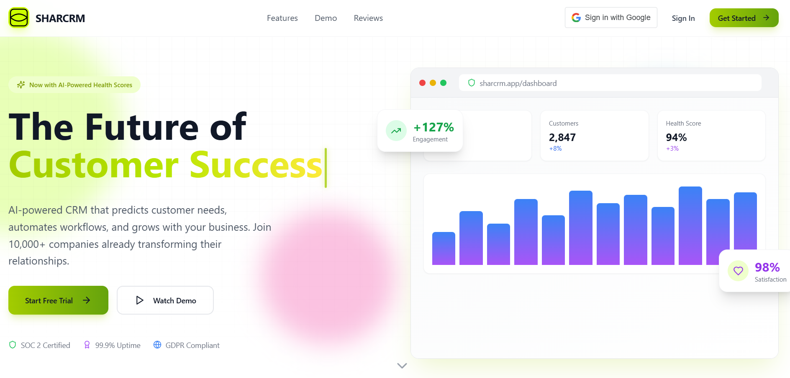

  

  

    
    
  

  <h3>🚀 Architecting the Future of Scalable Systems</h3>
  
  

    
    
    
  

---

### 🌌 Mission Control

I am a **Software Development Engineer** at **Vellore Institute of Technology**, dedicated to building high-performance, distributed applications. I thrive at the intersection of **AI**, **System Design**, and **Competitive Programming**.

- 🔭 **Active Development**: [SharCRM](https://github.com/luxmikant/SharCRM) & [TraderLens-AI](https://github.com/luxmikant/TraderLens-AI)
- ⚡ **Core Strength**: Algorithmic problem solving and backend architecture.
- 🧠 **Philosophy**: *"Simplicity is the soul of efficiency."*

---

### 🛠️ Tech Stack & Arsenal

  

---

### 🚀 Featured Project: SharCRM

  
  <h4><b>SharCRM - AI-Powered CRM Ecosystem</b></h4>
  
<i>"Enterprise-grade intelligence for every business."</i>

  
  <!-- Project Screenshot -->
  
    

  
  

 

> **Key Innovation**: Integrated **Google Gemini AI** for automated message generation and customer health scoring. Built with a high-performance **Express 5** backend and a glass-morphic **React + Vite** frontend.

---

### 📂 Other Innovations

<table border="0">
  <tr>
    <td width="50%" valign="top">
      <h4>📈 <a href="https://github.com/luxmikant/TraderLens-AI">TraderLens-AI</a></h4>
      
Leveraging Python and AI to provide deep analytical insights into market trends and trading patterns.

    </td>
    <td width="50%" valign="top">
      <h4>💻 <a href="https://github.com/luxmikant/Codegiest2025">Codegiest2025</a></h4>
      
Exploration into cutting-edge web technologies and performance optimization for the next generation of web apps.

    </td>
  </tr>
</table>

---

### 📊 Engineering Metrics

  
   
  
   
  

---

### 🏆 Milestones & Recognition

- 📄 **Published Researcher**: Early detection of Alzheimer's disease using AI (Springer).
- 🏆 **Hackathon Finalist**: Top 10 in Hack2Byte 2.0.
- 🎯 **Competitive Programming**: **Specialist** on Codeforces | **400** AtCoder | **450+** LeetCode.

---

  
   
  <i>"Code is like humor. When you have to explain it, it's bad."</i>

